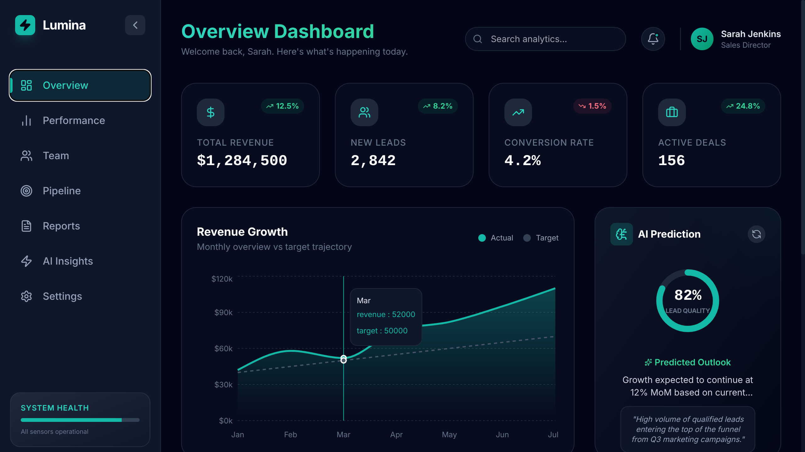
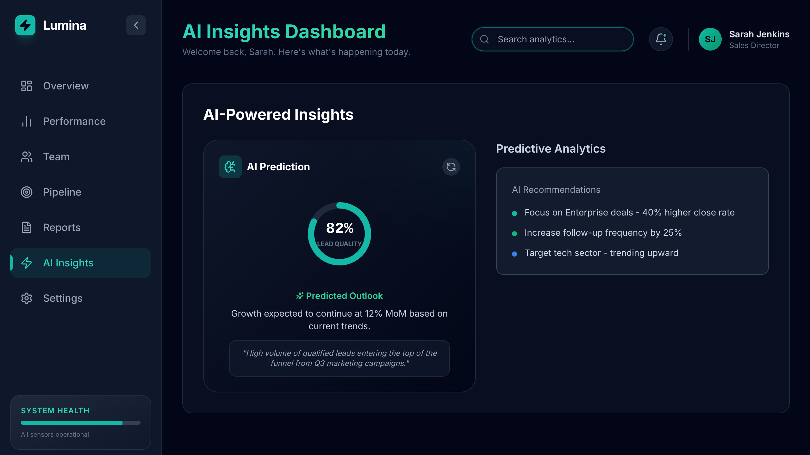
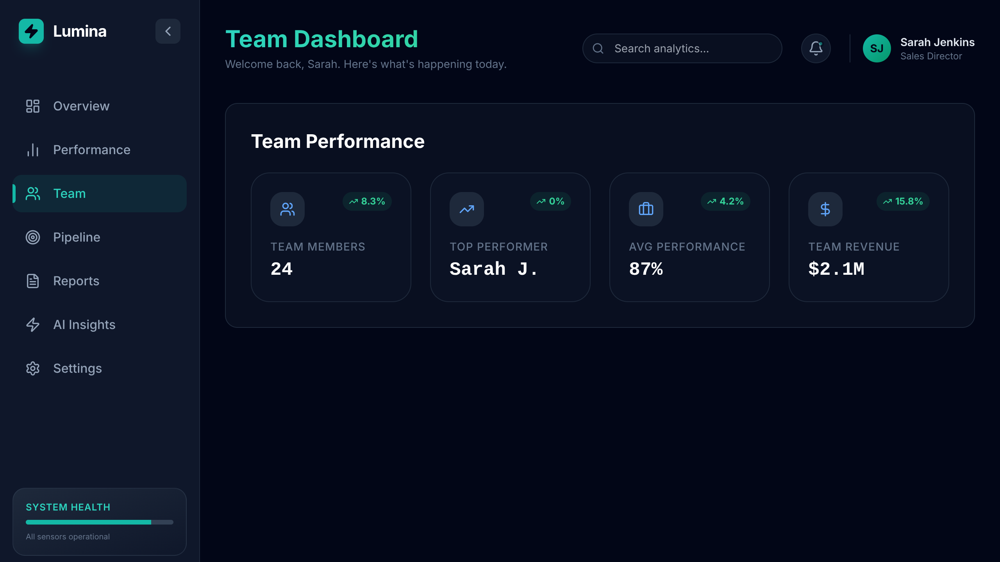
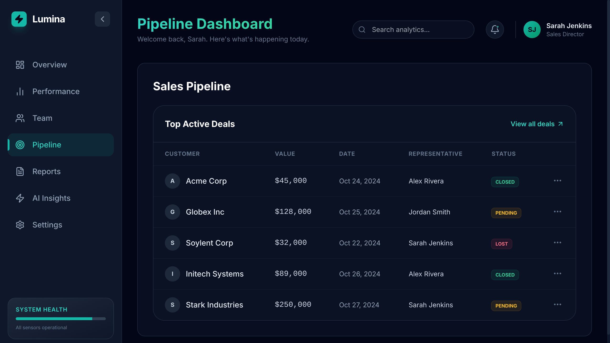
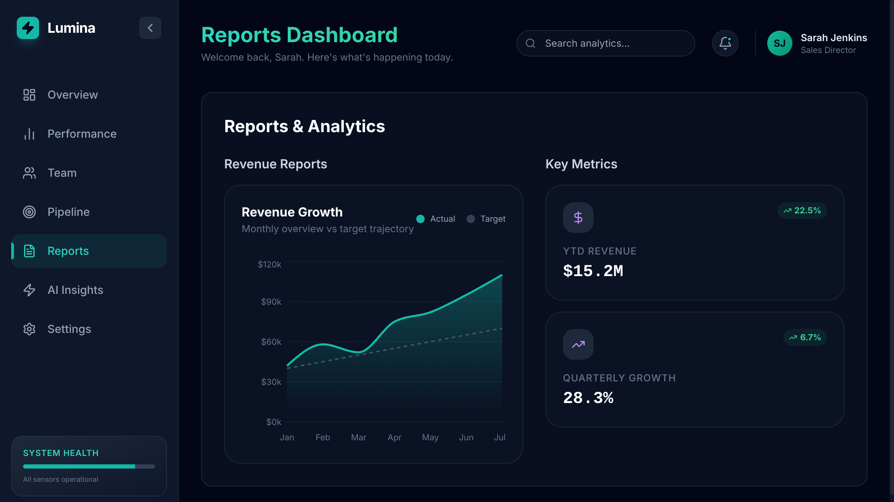
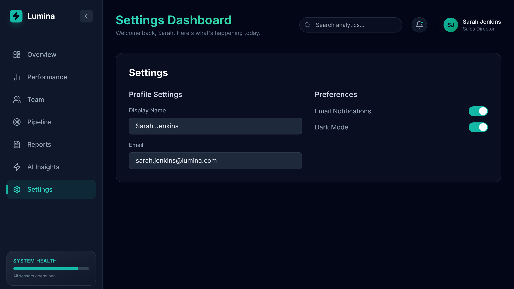

# 🚀 Lumina Sales Intelligence Dashboard

<div align="center">




*A cutting-edge AI-powered sales intelligence platform with real-time analytics and predictive insights*

[🔗 Live Demo](https://ai-powered-sales-dashboard.vercel.app/) • [📖 Documentation](#features) • [🚀 Quick Start](#quick-start)

</div>

---

## ✨ Overview

Lumina Sales Intelligence is a modern, AI-driven sales dashboard that transforms raw data into actionable insights. Built with React 19 and powered by Google's Gemini AI, it features a sleek midnight navy interface with neon teal accents, delivering enterprise-grade analytics in an intuitive package.

### 🎯 Key Highlights

- **AI-Powered Insights** - Leverages Google Gemini AI for predictive analytics and recommendations
- **Real-Time Analytics** - Live data visualization with interactive charts and metrics
- **Modern UI/UX** - Sleek dark theme with smooth animations and responsive design
- **Multi-Page Navigation** - Comprehensive dashboard with dedicated sections for different business aspects
- **Performance Optimized** - Built with Vite for lightning-fast development and production builds

---

## 🌟 Features

### 📊 **Dashboard Overview**
- **Revenue Tracking** - Real-time revenue metrics with trend analysis
- **Lead Management** - New leads tracking with conversion rate monitoring
- **Deal Pipeline** - Active deals visualization with status tracking
- **Performance Metrics** - Key performance indicators with percentage changes

### 🤖 **AI Intelligence**
- **Predictive Analytics** - AI-powered forecasting and trend prediction
- **Smart Recommendations** - Automated insights for sales optimization
- **Lead Scoring** - Intelligent lead prioritization based on conversion probability
- **Performance Insights** - AI-driven analysis of sales team performance

### 📈 **Analytics & Reporting**
- **Interactive Charts** - Dynamic revenue charts with Recharts integration
- **Team Performance** - Individual and team-wide performance tracking
- **Custom Reports** - Detailed analytics with exportable data
- **Real-Time Updates** - Live data synchronization and updates

### 🎨 **User Experience**
- **Responsive Design** - Optimized for desktop, tablet, and mobile devices
- **Dark Theme** - Professional midnight navy theme with neon teal accents
- **Smooth Animations** - Framer Motion powered transitions and interactions
- **Intuitive Navigation** - Clean sidebar navigation with active state indicators

---

## 🛠️ Tech Stack

### **Frontend**
- **React 19.2.3** - Latest React with concurrent features
- **TypeScript 5.8.2** - Type-safe development
- **Vite 6.2.0** - Next-generation frontend tooling
- **Tailwind CSS** - Utility-first CSS framework

### **UI & Animation**
- **Framer Motion 12.23.26** - Production-ready motion library
- **Lucide React 0.562.0** - Beautiful & consistent icon library
- **Recharts 3.6.0** - Composable charting library

### **AI & Backend**
- **Google Gemini AI 1.34.0** - Advanced AI capabilities
- **RESTful APIs** - Clean API integration architecture

---

## 🚀 Quick Start

### Prerequisites
- **Node.js** (v18 or higher)
- **npm** or **yarn**
- **Gemini API Key** (Get it from [Google AI Studio](https://ai.google.dev/))

### Installation

1. **Clone the repository**
   ```bash
   git clone https://github.com/yourusername/lumina-sales-intelligence.git
   cd lumina-sales-intelligence
   ```

2. **Install dependencies**
   ```bash
   npm install
   ```

3. **Environment Setup**
   ```bash
   # Create .env file
   cp .env.example .env
   
   # Add your Gemini API key
   echo "GEMINI_API_KEY=your_api_key_here" > .env
   ```

4. **Start development server**
   ```bash
   npm run dev
   ```

5. **Open your browser**
   ```
   http://localhost:3000
   ```

### Build for Production

```bash
# Build the project
npm run build

# Preview production build
npm run preview
```

---

## 📱 Screenshots

<div align="center">

### 🏠 Dashboard Overview
*Complete sales intelligence dashboard with real-time metrics and AI insights*


---

### 📊 Performance Analytics
*Detailed performance tracking with team metrics and growth indicators*


---

### 🤖 AI Insights Panel
*AI-powered recommendations and predictive analytics powered by Google Gemini*



---

### 👥 Team Management
*Team performance overview with individual metrics and collaboration tools*



---

### 🎯 Sales Pipeline
*Interactive pipeline management with deal tracking and status updates*



---

### 📈 Reports & Analytics
*Comprehensive reporting with revenue analysis and key performance metrics*



---

### ⚙️ Settings & Configuration
*Customizable dashboard settings and user preferences*



</div>

> **📸 Note**: Screenshots show the actual dashboard interface with dark theme, neon teal accents, and responsive design. The dashboard features real-time data visualization, interactive charts, and AI-powered insights.

---

## 🏗️ Project Structure

```
lumina-sales-intelligence/
├── 📁 components/           # Reusable React components
│   ├── AISection.tsx       # AI insights component
│   ├── DealsTable.tsx      # Sales pipeline table
│   ├── RevenueChart.tsx    # Interactive revenue charts
│   ├── Sidebar.tsx         # Navigation sidebar
│   └── StatCard.tsx        # Metric display cards
├── 📁 services/            # API and external services
│   └── gemini.ts          # Google Gemini AI integration
├── 📄 App.tsx             # Main application component
├── 📄 index.tsx           # Application entry point
├── 📄 types.ts            # TypeScript type definitions
└── 📄 vite.config.ts      # Vite configuration
```

---

## 🎨 Design System

### Color Palette
- **Primary**: `#00d4aa` (Neon Teal)
- **Background**: `#020617` (Midnight Navy)
- **Surface**: `#0f172a` (Dark Slate)
- **Text**: `#f8fafc` (Light Slate)
- **Accent**: `#1e293b` (Medium Slate)

### Typography
- **Primary Font**: Inter (Clean, modern sans-serif)
- **Monospace**: JetBrains Mono (Code and data display)

---

## 🔧 Configuration

### Environment Variables
```env
GEMINI_API_KEY=your_gemini_api_key_here
VITE_APP_NAME=Lumina Sales Intelligence
VITE_API_URL=https://api.yourdomain.com
```

### Vite Configuration
The project uses a custom Vite configuration with:
- React plugin for JSX support
- Path aliases for clean imports
- Environment variable handling
- Development server optimization

---

## 🚀 Deployment

### Vercel (Recommended)
```bash
# Install Vercel CLI
npm i -g vercel

# Deploy
vercel --prod
```

### Netlify
```bash
# Build the project
npm run build

# Deploy dist folder to Netlify
```

### Docker
```dockerfile
FROM node:18-alpine
WORKDIR /app
COPY package*.json ./
RUN npm install
COPY . .
RUN npm run build
EXPOSE 3000
CMD ["npm", "run", "preview"]
```

---

## 🤝 Contributing

Contributions are welcome! Please feel free to submit a Pull Request.

1. Fork the project
2. Create your feature branch (`git checkout -b feature/AmazingFeature`)
3. Commit your changes (`git commit -m 'Add some AmazingFeature'`)
4. Push to the branch (`git push origin feature/AmazingFeature`)
5. Open a Pull Request

---

## 📄 License

This project is licensed under the MIT License - see the [LICENSE](LICENSE) file for details.

---

## 👨‍💻 Author

**Mohamud**
- LinkedIn: [My Profile](https://www.linkedin.com/in/mohamud24/)

---

<div align="center">

**⭐ Star this repository if you found it helpful!**

Made with ❤️ and ☕ by [Your Name]

</div>
